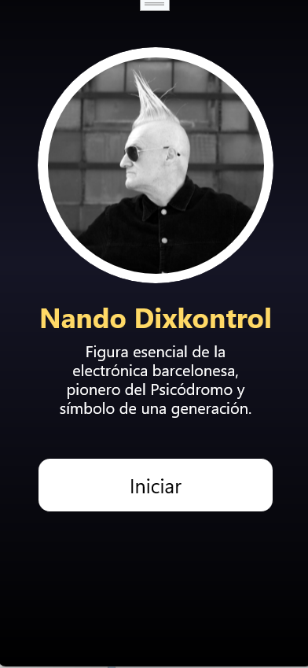
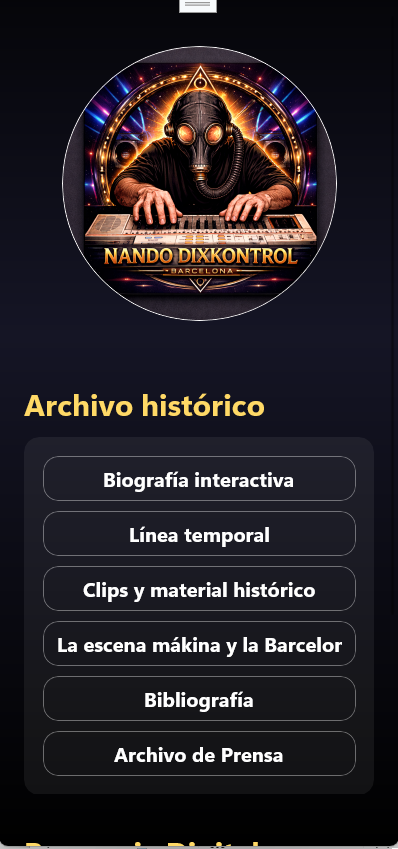

<h1 style="font-size: 34px; font-weight: bold;">🎧 Aplicación de Nando Dixkontrol</h1>

Archivo histórico, sesiones, prensa y legado de una leyenda de la electrónica catalana.

<h2 style="font-size: 28px; font-weight: bold;">📸 Vista previa de la aplicación</h2>

<h2 style="font-size: 28px; font-weight: bold;">🌀 ¿Qué es esta aplicación?</h2>

La aplicación oficial de <strong>Nando Dixkontrol</strong> es un recorrido interactivo por la historia, la música y el legado de uno de los DJs más influyentes de la escena mákina y de la Barcelona preolímpica.
Está diseñada para que cualquier persona —fans, curiosos o amantes de la cultura electrónica— pueda explorar su obra de forma cómoda, visual y ordenada.
No necesitas conocimientos técnicos: todo está pensado para que navegues con facilidad.

<h2 style="font-size: 28px; font-weight: bold;">⭐ Características principales</h2>

<h3 style="font-size: 22px; font-weight: bold;">📚 Archivo Histórico</h3>
<ul>
  <li>Biografía interactiva</li>
  <li>Línea temporal</li>
  <li>Clips y material documental</li>
  <li>Prensa, entrevistas y artículos oficiales</li>
  <li>Bibliografía y referencias</li>
</ul>

<h3 style="font-size: 22px; font-weight: bold;">🎶 Sesiones y Música</h3>

Accede a sesiones míticas como:

<ul>
  <li>Psicódromo</li>
  <li>Club Brione</li>
  <li>Grabaciones especiales y material exclusivo</li>
</ul>

Cada sesión incluye un reproductor integrado para escucharla directamente desde la app.

<h3 style="font-size: 22px; font-weight: bold;">🌐 Presencia Digital</h3>
<ul>
  <li>Spotify</li>
  <li>Facebook</li>
  <li>Instagram</li>
  <li>YouTube</li>
</ul>

Todo centralizado en un único lugar.

<h3 style="font-size: 22px; font-weight: bold;">🎨 Diseño y experiencia</h3>

La aplicación está creada con una estética oscura, elegante y moderna, inspirada en:

<ul>
  <li>La cultura rave</li>
  <li>El imaginario del Psicódromo</li>
  <li>La identidad visual de Nando Dixkontrol</li>
</ul>

Incluye animaciones suaves, iconografía clara y una navegación pensada para que cualquier usuario se sienta cómodo desde el primer momento.

<h2 style="font-size: 28px; font-weight: bold;">📱 ¿Para quién está pensada?</h2>
<ul>
  <li>Fans de Nando Dixkontrol</li>
  <li>Amantes de la música mákina</li>
  <li>Personas interesadas en la historia de la electrónica catalana</li>
  <li>Usuarios que quieran descubrir material histórico y sesiones exclusivas</li>
  <li>Cualquier persona que quiera explorar un archivo digital bien organizado y accesible</li>
</ul>

<h2 style="font-size: 28px; font-weight: bold;">📝 Notas finales</h2>

Este proyecto busca preservar y difundir el legado de <strong>Nando Dixkontrol</strong> con respeto, cariño y fidelidad histórica.
Si tienes sugerencias o deseas colaborar, puedes ponerte en contacto con el equipo desarrollador.

